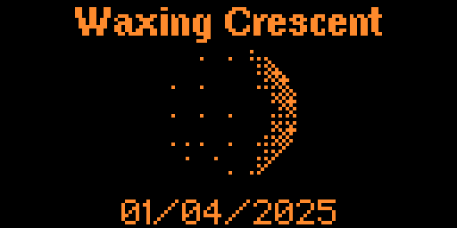

# Moon Phases App

A simple application to display the current phase of the moon along with additional lunar information.

For Flipper Zero device.

## Features

- Display current moon phase with visual representation
- Show moon illumination percentage
- Provide information about moon rise and set times
- Display current lunar phase name (e.g., "Waxing Crescent", "Full Moon")
- Simple, clean interface

## Screenshots




## 

- [Flipper Zero Catalog]()
- Download latest binary from ``/dist/p1x_moon_phases.fap```

## License

MIT License - See LICENSE file for details
